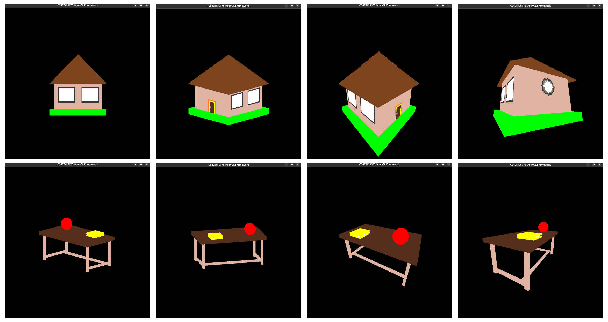

---
title: CS675 2022 - Assignment 1 - Voxelized Modeling
authors: "Ashutosh Sathe (21q050012), Animesh (21q050015)"
fontsize: 10pt
geometry: 
    - top=1.75cm
    - bottom=1.75cm
    - left=1.5cm
    - right=1.5cm
...

# Declaration

> The entire code of this assignment is purely our own work and we have not taken any assistance from other students or copied the code from internet and at any point of time we both will be able to explain any part of the code that we have written.

1. Ashutosh Sathe (21q050012)
2. Animesh (21q050015)

# Screenshots of rendered models



# Additional functionality

Pressing "v/V" switches the projection matrix between orthographic and perspective projection. In the screenshots above, left 2 columns are with orthographic projection while the right 2 columns are with perspective projection. Many of the hyperparameters such as $N$, $n$ are also configurable via `main.hpp`. If $N$ was changed to be more than $100$, `grid_vs.glsl` should also reflect that change.

# Notation

* $N$ -- The number of cells in the grid
* $n$ -- Size of each cell
* $D_\text{min}$ -- Minimum (WCS) coordinate of the grid on any axis (same on all axes)
* $D_\text{max}$ -- Maximum (WCS) coordinate of the grid on any axis (same on all axes)

# Drawing the grid

For drawing an $N \times N \times N$ grid, we need to draw $O(N^3)$ lines. Assuming 2 points per line, 3 floating point coordinates per point, this approach will need to store $\sim 100^3 \times 2 \times 3 \times 4$ bytes just to draw grid lines ! Our implementation makes use of the inherent symmetries when drawing these grid lines to significantly reduce the memory required. We observe that in a grid line, many lines are parallel to each other and the endpoints differ only in one coordinate. Therefore, we only store points required to draw lines on X-Y plane and reuse these coordinates in various different ways to fill the complete grid. Because of this, we only require $O(N)$ memory for drawing grid as opposed to $O(N^3)$ in the naive approach.

```{.matplotlib format=PDF caption="Illustration of instanced drawing for $N=5$, instances = 5"}
import numpy as np
import matplotlib.pyplot as plt
from mpl_toolkits.mplot3d import Axes3D

fig = plt.figure()
ax = fig.add_subplot(111, projection='3d')

ax.set(proj_type='persp')
xs = np.arange(1,11,1)
ys = np.ones_like(xs)
zs = np.ones_like(xs)
colors = ['r', 'g', 'k', 'y', 'b', 'c']
for j in range(5):
    for i in range(5):
        ax.plot(xs,ys+i*2, zs+j*2, c=colors[j])

#elevatoion=7, azimuth=-67, roll=0
ax.view_init(7,-67)
ax.set_xlim((0,11))
ax.set_ylim((0,11))
ax.set_zlim((0,11))
ax.grid(False)

ax.set_xticks([])
ax.set_yticks([])
ax.set_zticks([])

fig.tight_layout()
```

Figure above shows our approach for $N=5$. We only store coordinates to draw red colored lines in the VBO. To draw next set of lines (green, black, yellow and blue), we can use these exact same points in $(x, y)$ but we must draw them at some $z$ height. We pass this offset $z$ information via a uniform type of shader variable where offset of $i^\text{th}$ line is calculated as follows:


$$
\text{offset}_i = D_{\text{min}} + \frac{i-1}{N} D_{\text{max}}
$$

This completes all the lines that need to be drawn for this $5\times 5\times 5$  grid that are parallel to $XY$ plane. Now we can use the same trick to draw lines parallel to $XZ$ and $YZ$ planes by just swapping around the coordinates. Note that for drawing lines parallel to other planes we do not need to push more points to VBO, we just need to change their ordering in the shader by accessing the `gl_InstanceID` variable. For first $N+1$ instances, we use the uniform array value as the $z$ while using the VBO information as $x, y$. For next $N+1$ instances, we use the uniform array value as the $x$ value while the VBO information as $y, z$ and for the last $N+1$ instances, we use the uniform array value as $y$ value while interpreting the VBO information as $x, z$.

Overall, we use `glDrawArraysInstanced(GL_LINES, 0, 2*(N+1), 3*(N+1))` to draw the entire grid in one draw call while storing only $O(N)$ points in the VBO. We also use transparency and enable blending in order to lessen the obstruction effect of the grid.

<!--
* Usually for drawing a `NxNxN` grid one may need to define `2*(N^N^N)` vertices in the grid_vbo (for storing both `x&y` coords.), but here in this implementation we have tried to reduce the memory overhead from the graphics memory by using the `glDrawArraysInstanced()` function to draw the grid lines instead of using `glDrawArrays()`. This approach helped us to hugely reduce the memory overhead from `O(N^N^N)` to `O(N)`.


* This function helped us to reuse the limited set of vertices (`8*N` to be exact, 2 times for storing both ends of the vertices in both x and y axis) while drawing the grid-lines. We are storing only the end points of a grid-line in each axis. To ensure the robustness of the application, i.e. to handle varying grid sizes (`N`) and ensuring the cell size of `5x5x5, we have defined `N_UNITS` as 5 whereas `DRAW_MIN` and `DRAW_MAX` which defines the bounds of the grid depends on `N_CELLS (N)` and `N_UNITS` such that it can accomodate a varying number of cells of size `5x5x5` each.


**NOTE**: User can vary the value of `N_CELLS` in `main.hpp` to change the grid size, be default it is set to `100` which means a grid of `100x100x100` cells.


* We have created a separate array called **`grid_offsets`** which holds the offset distances between successive grid-lines which is then used by the grid vertex shader while drawing the grid-lines.


* Grid offsets are stored in a way such that the ith offset defines the distance between the i-1th and ith grid line. i.e:

```
	grid_offsets[i] = DRAW_MIN + (i-1) * (DRAW_MAX - DRAW_MIN)/ N_CELLS
```
* While drawing the grid-lines, we first started with the horizontal lines in `x-z` plane, later we are rotating the lines by `90 degrees` to draw vertical lines in the `x-z` plane. This procedure draws a 2D grid in `x-z` plane, which is finally repeated in other `y` axis values to fill the whole 3D volume.

* Plots representing drawing of the grid lines:
-->

# Drawing the cursor cube


Idea behind drawing the cursor cube was very similar to [`Tutorial_02`](https://github.com/paragchaudhuri/cs475-tutorials/tree/master/Tutorial_02). However, the main difference is that cube will be moving around the grid. We maintain a global position of cursor using 3 floating point numbers `cursor_x`, `cursor_y`, `cursor_z`. These point to the left-bottom-back coordinate of the cube (point $c$ in Fig. 3) that cursor is currently on. First, we create a static cube such that `cursor_x = cursor_y = cursor_z = 0` and push it to VBO. Then we use callbacks to listen to relevant keypresses and update these values accordingly. For every subsequent render of the cursor cube, we simply add the `[cursor_x, cursor_y, cursor_z]` vector to each vertex of the cube to get the current (and correctly translated) version of cube. Since this translation vector is common to all vertices, we pass it as a uniform to the vertex shader.

When the cursor cube is on a filled cell, we need to make it bigger for better visualization. To achieve this, we created one more cube which is larger than the standard cube. Our method of translating the cube using uniforms is still compatible with this larger version of cube since the larger cube's center is same as standard cube's center. Now we have 2 cubes -- 1 standard and 1 larger. To switch between these, we simply maintain a pointer to their base addresses. If we detect that cube's state has changed (non-filled to filled or vice versa) then we update the pointer accordingly and refresh VBO to load the correct version of cube. We also maintain a similar pointer for color attributes which by default points to default bright green color or points to model's color when the cube is on a filled cell.

# Drawing the model

**Representation:** 

A model is simply a list of cube coordinates and their corresponding colors. We characterize each cube by its left-bottom-back coordinate (i.e. point $c$ in Fig. 3) and only store that in the model. C++-wise, this is simply a `std::map` which maps a `Point` (custom datatype similar to `glm::vec3`) representing left-bottom-back coordinate of a cube to a `Point` which represents color of that particular cube. The `Point` in key stores the $(x, y, z); x,y,z \in [D_\text{min}, D_\text{max}]$ coordinates while `Point` in value stores $(r, g, b); r,g,b \in [0, 1]$ values.

**Drawing:** 

To draw multiple cubes, we can simply generate 12 triangles for each cube, push them to VBO along with their colors and simply do `glDrawArrays(GL_TRIANGLES, ...)`. However, this naive approach requires a lot of memory. In the worst case, when all 1M blocks are filled, we will be storing 12M triangles ! While modern GPUs can easily push billions of triangles, we will certainly be doing a lot of unnecessary work and occupy a lot of memory. Each triangle has 3 vertices, each vertex has 3 floating point coordinates which means this approach requires $12 \times 100^3 \times 3 \times 3 \times 4 \approx 400\text{MB}$ of RAM just to store triangle coordinates. The exact same amount of RAM will also be required to store triangle colors (each vertex has 3 colors which are floating point as well) which means in total the program will require 800MB RAM to draw the $100\times 100\times 100$ cube.

We reduce these requirements significantly by observing that when 2 cubes are adjacent to each other, the faces where they meet each other are never seen under any viewing conditions. This means that we do not need to store triangles corresponding to these faces in the VBO at all ! We maintain a list of "maybe-visible" triangles and only pass these triangles to the rasterizer to rasterize. A similar list is maintained which stores the colors of the corresponding triangles.

**Insertion/Deletion:**


Insertion/deletion of a cube uses a neat geometric observation. Let's say there's a cube at origin $(0, 0, 0)$ and we want to add a cube at $(0, 0, n)$. Here, the right face of cube at $(0, 0, 0)$ and the left face of the cube we want to add $(0, 0, n)$ coincide. As explained above, we will not store triangles for these coinciding faces in the VBO and therefore we must remove triangles for right face of $(0, 0, 0)$ from the existing list of triangles. To complete the addition of $(0, 0, n)$, we will add triangles corresponding to the remaining 5 faces of the cube at $(0, 0, n)$ since they do not coincide with any other cube. We can represent this operation as :

$$
\text{insertAt}(x, y, z):\;\;\;\;\text{addList}, \text{removeList} = \text{trianglesAt}(x, y, z), \;
\text{trianglesList} \leftarrow \text{trianglesList} - \text{removeList} + \text{addList}
$$

Since, the world is completely voxelized and that $\text{addList} \cup \text{removeList} = \text{allTriangles}, \text{addList} \cap \text{removeList} = \phi$ while removing the cube from $(x, y, z)$ we can just swap $\text{removeList}$ and $\text{addList}$ to get the desired result (Fig. 4). Note that here $\text{allTriangles}$ represents the full list of 12 triangles corresponding to 6 faces of the cube.

$$
\text{removeAt}(x, y, z):\;\;\;\;\text{addList}, \text{removeList} = \text{trianglesAt}(x, y, z), \;
\text{trianglesList} \leftarrow \text{trianglesList} - \text{addList} + \text{removeList}
$$

To continue the last example, let's say now we remove the cube inserted at $(0, 0, n)$ then not only do we have to remove the faces corresponding to 5 faces of the cube but we must make the left face of the cube at $(0, 0, 0)$ visible again. To make sure that triangles on opposite faces match, we make sure that ordering of vertices in the triangles on opposite faces is same.

With this kind of insertion or deletion, we are guaranteed that in case of model with 1M blocks, only $6 \times 2 \times 100 \times 100$ triangles will be visible at any given time. Despite this, the user may delete or insert the cube at the center of the model which is not visible through any of the sides. Therefore, we must overestimate the number of triangles in order to prevent out-of-memory errors.

For this, consider any face of the cube. Maximum of $N\times N$ quads are visible to us. But this face can be hollow from inside which can lead to a similar quad of size $(N-1)\times(N-1)$ visible from the inside. This can be further extended to get total number of "maybe-visible" (not from a visibility sense but from our algorithm which considers visibility through neighbors) will be $n^2 + (n-1)^2 + \dots = \sum_{j=1}^nj^2 = n(n+1)(2n+1)/6$. Therefore, total number of triangles $=2n(n+1)(2n+1)$ since there are 6 faces to a cube and 2 triangles/quad. 

This gives maximum amount of memory we need for storing triangle data as $2\times 100\times 101\times 201\times 3\times 3\times 4 \approx 140\text{MB}$ of RAM. The same amount will also be required to store colors. This means the maximum amount of RAM required in our approach is $\approx 280\text{MB}$ which is much better than $\approx 800\text{MB}$ requirement of naive approach.

**Saving/Loading:**

Saving requires us to store all the cubes in lexicographic order. This requirement is satisfied for free since C++ `std::map` stores data in lexicographic order of keys (which are `Point` instances in our case) by default ! Saving simply enumerates over all of the cubes and writes their information on every line. We also additionally store the value of $N$ on the very first line. This value of $N$ can be useful (although we did not implement it) to center small models into larger models and also detecting whether user is loading a larger model into smaller grid.

Loading procedure is similar to inserting a single cube except done for collection of all cubes after they have been read from the file. We also utilize the value of $N$ read from the first line of the file to warn user about potentially loading a larger model in smaller grid size. If any of the model blocks are outside the grid boundaries, we simply ignore such blocks and notify the user.

# References

* OpenGL tutorials -- [https://github.com/paragchaudhuri/cs475-tutorials](https://github.com/paragchaudhuri/cs475-tutorials)
* Using multiple shaders in OpenGL -- [https://gamedev.stackexchange.com/questions/22216/using-multiple-shaders](https://gamedev.stackexchange.com/questions/22216/using-multiple-shaders)
* Instanced drawing in OpenGL -- 
    1. [https://learnopengl.com/Advanced-OpenGL/Instancing](https://learnopengl.com/Advanced-OpenGL/Instancing)
    2. [https://registry.khronos.org/OpenGL-Refpages/gl4/html/glDrawArraysInstanced.xhtml](https://registry.khronos.org/OpenGL-Refpages/gl4/html/glDrawArraysInstanced.xhtml)
* Efficient meshing -- [https://0fps.net/2012/06/30/meshing-in-a-minecraft-game/](https://0fps.net/2012/06/30/meshing-in-a-minecraft-game/)
* Blending -- [https://learnopengl.com/Advanced-OpenGL/Blending](https://learnopengl.com/Advanced-OpenGL/Blending)
* Face-culling -- [https://learnopengl.com/Advanced-OpenGL/Face-culling](https://learnopengl.com/Advanced-OpenGL/Face-culling)
